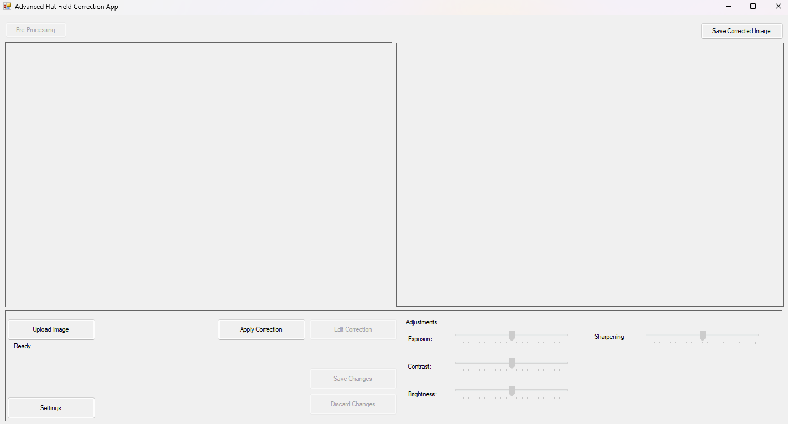
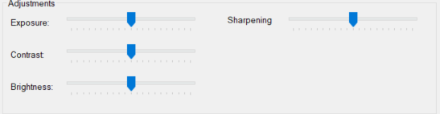

+++markdown
# Advanced Flat Field Correction App

## Overview

The **Advanced Flat Field Correction App** is a Windows Forms application designed to perform flat-field correction on images, particularly beneficial in fields like microscopy, medical imaging, and photography. The application offers a user-friendly interface with advanced features to enhance image quality by correcting uneven illumination and sensor defects.



## Features

- **Image Upload and Display:**
  - Upload images in common formats (`.bmp`, `.jpg`, `.jpeg`, `.png`).
  - Display original and corrected images side by side with support for large images.

- **Flat-Field Correction:**
  - Automatically generates dark and bright field images.
  - Applies flat-field correction using advanced algorithms.

- **Image Editing:**
  - Adjust brightness, contrast, and exposure of the corrected image.
  - Real-time preview of adjustments.
  - Save or discard changes.

- **User Interface Enhancements:**
  - **Scrolling and Zooming:**
    - Scroll through images using mouse wheel or touchpad gestures.
    - Zoom in/out with `CTRL + Mouse Wheel` or touchpad pinch gestures.
  - **Panning:**
    - Click and drag to move images within their panels.
  - **Dynamic GUI Resizing:**
    - Responsive layout that adjusts to different screen sizes.
  - **Settings:**
    - Select image mode (`Color`, `Infrared`, `X-Ray`).
    - Toggle dark mode theme.
    - Manage GPU settings for future acceleration support.

## Algorithms and Formulas Used

### 1. Flat-Field Correction

Flat-field correction is essential for removing artifacts caused by non-uniform illumination and sensor imperfections. The corrected image is computed using the formula:

$I_{\\text{corrected}}(x, y) = \\frac{I_{\\text{raw}}(x, y) - D(x, y)}{\\text{Gain}} \\times 255$

Where:

- $( I_{\text{raw}}(x, y) )$ is the raw image pixel intensity at position $( (x, y) )$.
- $( D(x, y) )$ is the dark field image pixel intensity.
- $( B_{\text{mean}} )$ and $( D_{\text{mean}} )$ are the mean intensities of the bright and dark field images, respectively.
- $( 255 )$ scales the corrected intensity back to the 8-bit image range.

**Implementation Details:**

- **Dark Field Image Generation:**
  - Simulated by reducing the brightness of the original image by 80%.

- **Bright Field Image Generation:**
  - Simulated by increasing the brightness of the original image by 50%.

- **Gain Calculation:**
  - Gain is calculated to prevent division by zero:

$\\text{Gain} = \\max(B_{\\text{mean}} - D_{\\text{mean}}, 1)$

### 2. Gaussian Smoothing

Gaussian smoothing is applied to both dark and bright field images to reduce noise and smooth out variations.

**Kernel Used:**

$K = \\frac{1}{16}$

\[
 \begin{matrix}
  1 & 2 & 1 \\
  2 & 4 & 2 \\
  1 & 2 & 1
 \end{matrix}
\]

**Convolution Formula:**

$I_{\\text{smoothed}}(x, y) = \\sum_{i=-1}^{1} \\sum_{j=-1}^{1} K(i+1, j+1) \\cdot I(x+i, y+j)$

Where $( I(x+i, y+j) )$ is the pixel intensity at the neighboring positions.

### 3. Image Adjustments

Adjustments for brightness, contrast, and exposure are applied using the following formula:

$I_{\\text{adjusted}} = \\text{Clamp} \\left( I_{\\text{corrected}} \\times (1 + B) \\times (1 + C + E), 0, 255 \\right)$

Where:

- $( I_{\text{corrected}} )$ is the corrected image pixel intensity.
- $( B )$ is the brightness adjustment factor $( \left( \frac{\text{Brightness Value}}{100} \right) )$.
- $( C )$ is the contrast adjustment factor $( \left( \frac{\text{Contrast Value}}{100} \right) )$.
- $( E )$ is the exposure adjustment factor $( \left( \frac{\text{Exposure Value}}{100} \right) )$.
- The `Clamp` function ensures the intensity stays within the valid range $([0, 255])$.

## User Interface

### Layout

- **Top Section:**
  - **Left Panel:** Displays the original image.
  - **Right Panel:** Displays the corrected image.

- **Bottom Control Panel:**
  - **Buttons:** Located at the top of the control panel for easy access.
    - `Upload Image`, `Apply Correction`, `Edit Correction`, `Save Changes`, `Discard Changes`, `Settings`.
  - **Adjustments Group Box:** Contains sliders for `Exposure`, `Contrast`, and `Brightness`.


### Controls and Shortcuts

- **Zooming:**
  - **With Mouse:** Hold `CTRL` and scroll the mouse wheel.
  - **With Touchpad:** Use pinch-to-zoom gestures (if supported).

- **Scrolling:**
  - Use mouse wheel or touchpad scrolling gestures.

- **Panning:**
  - Click and drag the image to move within its panel.

- **Buttons:**

  | Button               | Function                                                   |
  |----------------------|------------------------------------------------------------|
  | **Upload Image**     | Opens a dialog to select and upload an image.              |
  | **Apply Correction** | Processes the uploaded image using flat-field correction.  |
  | **Edit Correction**  | Enables adjustment sliders for fine-tuning.                |
  | **Save Changes**     | Saves adjustments made to the corrected image.             |
  | **Discard Changes**  | Reverts to the original corrected image without adjustments. |
  | **Settings**         | Opens the settings dialog for additional configurations.   |

## Usage Instructions

1. **Upload an Image:**
   - Click **Upload Image** and select the desired image file.

2. **Apply Flat-Field Correction:**
   - Click **Apply Correction** to process the image. The corrected image will display on the right panel.

3. **Edit Corrected Image:**
   - Click **Edit Correction** to enable adjustment sliders.
   - Adjust **Exposure**, **Contrast**, and **Brightness** as needed.
   - The image updates in real-time to reflect changes.



4. **Save or Discard Changes:**
   - Click **Save Changes** to keep adjustments.
   - Click **Discard Changes** to revert to the unadjusted corrected image.

5. **Settings:**
   - Click **Settings** to open the settings dialog.
   - Configure image mode, toggle dark mode, and manage GPU settings.

## Settings

- **Image Mode:**
  - **Color:** Processes images in color.
  - **Infrared:** Processes images as grayscale, optimized for infrared imaging.
  - **X-Ray:** Processes images as grayscale, optimized for X-ray imaging.

- **Dark Mode:**
  - Toggle between light and dark themes for the application interface.

- **GPU Settings:**
  - Enable or disable GPU acceleration (planned for future implementation).
  - Select an available GPU from the list if enabled.


## Requirements

- **Operating System:** Windows 7 or later.
- **.NET Framework:** Version 4.7.2 or higher.
- **Hardware:** A mouse or touchpad with gesture support for optimal experience.

## Installation

1. **Clone the Repository:**

   ```bash
   git clone https://github.com/YourUsername/FlatFieldCorrectionApp.git
   ```

2. **Open the Solution:**
   - Open `FlatFieldCorrectionApp.sln` in Visual Studio.

3. **Build the Solution:**
   - Restore any NuGet packages if prompted.
   - Build the solution to compile the application.

4. **Run the Application:**
   - Start the application from Visual Studio or run the executable from the build output directory.

## Future Enhancements

- **GPU Acceleration:**
  - Implement GPU-based processing using libraries like OpenCL or CUDA for faster image processing.

- **Advanced Touch Support:**
  - Enhance support for touch gestures on devices with touchscreens.

- **Performance Optimization:**
  - Optimize image processing algorithms for large images and improve responsiveness.

- **Error Handling and Validation:**
  - Improve error messages and handle edge cases for better user experience.

## Contributing

Contributions are welcome! Please follow these steps:

1. **Fork the Repository**

2. **Create a Feature Branch**

   ```bash
   git checkout -b feature/YourFeature
   ```

3. **Commit Your Changes**

   ```bash
   git commit -am 'Add a new feature'
   ```

4. **Push to the Branch**

   ```bash
   git push origin feature/YourFeature
   ```

5. **Open a Pull Request**

## License

This project is licensed under the GNU General Public License v3.0. See the [LICENSE](LICENSE) file for details.

## Contact

For questions or support, please open an issue on GitHub or contact the maintainer at [tnvolfan034@gmail.com]

---

**

Note:** This application is a work in progress. Some features, like GPU acceleration, are planned for future releases.

---
+++
